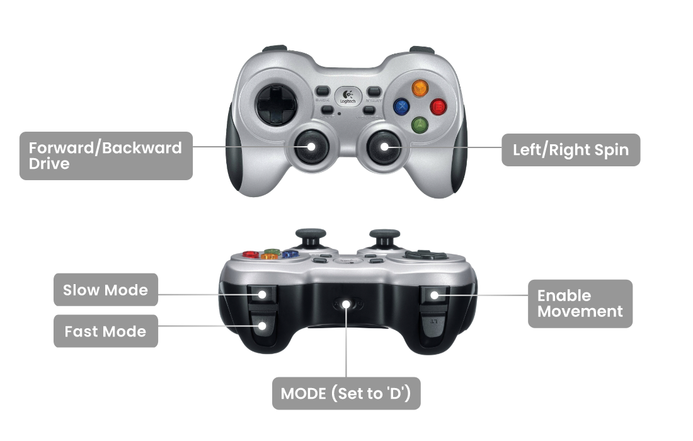

# rosbot-xl-gamepad

A GitHub template for ROSbot XL: a gamepad control 

## Quick Start

Choose one of the supported gamepads:

- [Logitech F710](#logitech-f710)
- [Steamdeck](#steamdeck)

## Logitech F710

Make sure you have `yq` installed:

```
sudo curl -L https://github.com/mikefarah/yq/releases/download/v4.35.1/yq_linux_arm64 -o /usr/bin/yq
sudo chmod +x /usr/bin/yq
```

Flash the correct firmware:

```
git clone https://github.com/husarion/rosbot-xl-gamepad
cd rosbot-xl-gamepad
chmod +x flash_rosbot_firmware.sh
./flash_rosbot_firmware.sh
```

Clone this repository on the robot, connect a gamepad to the USB type A port at the back panel of ROSbot XL and run

```bash
docker compose -f compose.f710.yaml up
```

### Controlling the robot



> [!NOTE]
> More details on the use of the **F710 Gamepad** and `joy2twist` package in ROS 2 can be found in Husarion's article in the [ROS Equipment section](https://husarion.com/tutorials/ros-equipment/gamepad-f710/).

## Steamdeck

ROSbot XL and Steamdeck need to be in the same LAN network at first. After that:

1. Clone this repository on the ROSbot XL and run:

```
docker compose -f compose.steamdeck-rosbot.yaml up
```

2. Clone this repository on the steamdeck and run:

```
docker compose -f compose.steamdeck.yaml up
```
